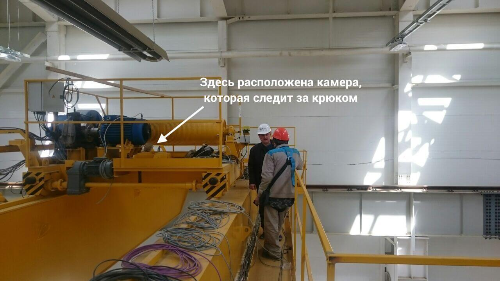

# Контроль крюка на строительном кране
Клиент хотел упростить работу со строительным краном. Чтобы кран сам останавливался, если груз за что-то зацепился. Или чтобы корректировал положение подвесного крюка, если тот случайно раскачался.

## Как это работает:
Цифровая камера на верху крана смотрит на крюк, на котором изображена метка. С помощью машинного зрения программа распознает метку и вычисляет ее смещение относительно центра. Система управления «говорит» крану двинуться так, чтобы компенсировать это смещение.
Можно взяться за крюк и потащить его в сторону – тогда **кран поедет как на веревочке**.

