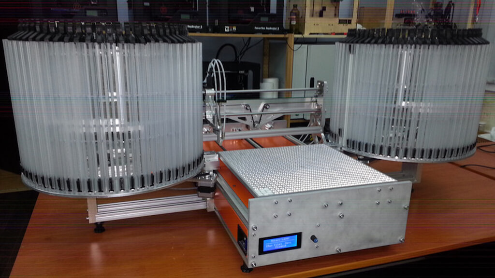

# Робот, который складывает мозаику
Раньше работники компании вручную складывали мозаику из керамики. Мы разработали аппарат, который взял это на себя.

## Как это работает:
Вы загружаете картинку, робот «в своей голове» делит ее на клетки 64х64. Затем сам подбирает кусочки керамики нужного цвета и выкладывает панно. Аппарат работает с 128 цветами. Оператору не надо возиться с плитками и сортировать их.

Мы сделали ПО, а над «железной» частью проекта работала компания «Русский инженер».

> «Раньше мы использовали ручной труд. Но иногда работники ошибались, и лишняя деталь портила общий вид мозаики. Робот решил эту проблему, а к тому же увеличил скорость производства, ведь машине не нужно отдыхать».
> <cite>— Клиент</cite>
