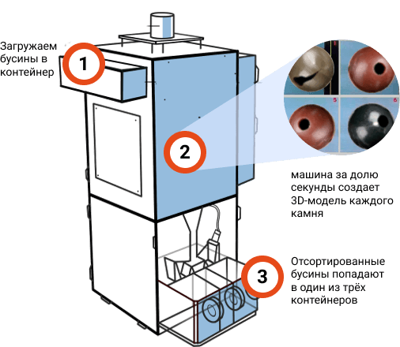

# Сортировщик бус
Раньше работники завода вручную сортировали камни для бус, на глаз определяя форму и наличие брака. Иногда сотрудники делали ошибки и пропускали плохие камни. Владелец завода заказал аппарат, который сам сортирует бусины.

## Как это работает:
Вы загружаете бусины в ящик. С помощью камер машина за долю секунды создает 3D-модель каждого камня. Затем система анализирует, есть ли на бусине сколы или другие дефекты, считывает размеры и форму. Еще через секунду камень попадает в соответствующий отсек.

